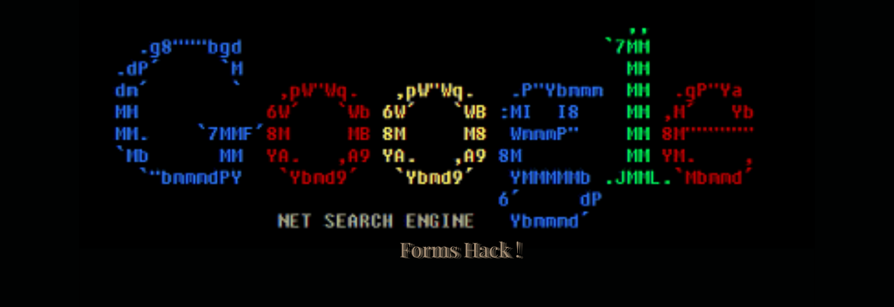

# Google Forms

Easily Hack Google Forms User Data Entries with wide range of possible  
attacks including the rapid and secret finder attacks and detailed branch attacks.  

# Be The Employee Of The Year ! :tada:

# Celebrate ! :beers:

# Selecting Nodes :balloon:
**XPath**  Expansion Algorithms

| Expression | Description                                |
| ---------- | ------------------------------------------ |
| nodename	 | Selects all nodes with the name "nodename" |
|    /	     | Selects from the root node                 |
|   //	     | Selects nodes in the document from the current node that match the selection no matter where they are |
|   .	     | Selects the current node                   |
|   ..	     | Selects the parent of the current node     |
|   @	     | Selects attributes                         |

##### In the table below we have listed some path expressions and the result of the expressions:

| Path Expression |	Result |
| --------------- | ------ |
| bookstore       |	Selects all nodes with the name "bookstore" |
| /bookstore      |	Selects the root element bookstore          |
| bookstore/book  |	Selects all book elements that are children of bookstore |
| //book          |	Selects all book elements no matter where they are in the document |
| bookstore//book |	Selects all book elements that are descendant of the bookstore element, no matter where they are under the bookstore element |
| //@lang	      | Selects all attributes that are named lang |

[!]**Note**: (If the path starts with a slash ( / ) it always represents an absolute path to an element !)

# What the Heck is XPATH ? :rainbow:
**XPath**  uses *path expressions* to select nodes in an XML document. The node is selected by following a path or steps. The most useful path expressions are listed below

# Finding XPATH :bulb:
**XPath** of Elements are available by using F12 on the live webpage by entering  
the chrome developer console and select xpath by copy selections

# Attacks :sunglasses:

| Menu            | Type           | Description                       |
| --------------- | -------------- | --------------------------------- |
| Rapid Input     | Input Attacks  | Rapid Input Taking and Data Entry |                 |
| Secret Finder   | Answer Finder  | Secret of Questions Finding       |
| Exit            | Program Exit   | Exits The Program                 |

# Materials :yum:

| Materials  | Details     | Description                      |
| ---------- | ----------- | -------------------------------- |
| Python     | 3.8         | Used Python 3.8                  |
| Selenium   | 3.141.0     | Selenium For Element Controlling |
| PyFiglet   | 0.7         | For Providing Banner             |

# Issues :sweat_drops:

- [ ] Rapid Multiple Items
- [ ] Closing Rapid Tab Error

# Possible TODO :fire:

- [ ] Errors Decoration
- [ ] Output Decoration

# License :confused:
Copyright (c) 2021 Ashkan Ebtekari

Permission is hereby granted, free of charge, to any person obtaining a copy
of this software and associated documentation files (the "Software"), to deal
in the Software without restriction, including without limitation the rights
to use, copy, modify, merge, publish, distribute, sublicense, and/or sell
copies of the Software, and to permit persons to whom the Software is
furnished to do so, subject to the following conditions:

The above copyright notice and this permission notice shall be included in all
copies or substantial portions of the Software.

THE SOFTWARE IS PROVIDED "AS IS", WITHOUT WARRANTY OF ANY KIND, EXPRESS OR
IMPLIED, INCLUDING BUT NOT LIMITED TO THE WARRANTIES OF MERCHANTABILITY,
FITNESS FOR A PARTICULAR PURPOSE AND NONINFRINGEMENT. IN NO EVENT SHALL THE
AUTHORS OR COPYRIGHT HOLDERS BE LIABLE FOR ANY CLAIM, DAMAGES OR OTHER
LIABILITY, WHETHER IN AN ACTION OF CONTRACT, TORT OR OTHERWISE, ARISING FROM,
OUT OF OR IN CONNECTION WITH THE SOFTWARE OR THE USE OR OTHER DEALINGS IN THE
SOFTWARE.

# Expansion :heart:
Developed With LOVE By Ashkan Ebtekari
